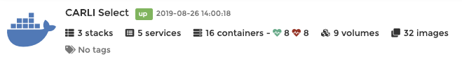
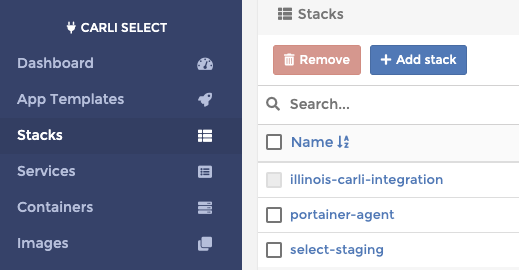
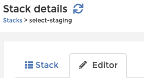

# Deploying CARLI Select 

## Deployment process

CARLI Select is composed of two custom docker containers which must be rebuilt before deploying.
1) `registry.carli.pixodev.net/carli-select/middleware`
2) `registry.carli.pixodev.net/carli-select/browser-clients`

### 1) Build new docker images and push them to the private registry.

Simply run [this Jenkin's job](https://jenkins.pixotech.com/job/CARLI/job/carli-select/)

Details:
* All of the work is done by [./jenkins-entrypoint.sh](`../jenkins-entrypoint.sh`)
    * Aside: Jenkins itself is not an important part of this process, this script can just as easily be run manually.
* This job does not trigger automatically so it should be run manually as the first step of a deployment.
* The docker image tags are based on the npm module version numbers in the `package.json` file of each deployed module.
* The script will increment those numbers, commit, tag, and push the change back to Git.
* The script will push the resulting images to a private docker registry, which runs on the same ec2 instances
  that Jenkin's uses as an executor.


### 2) Update the target instance to use the new versions.

Once the new images have been built and pushed to the registry, the instance being updated just needs to be told
to use them.

The staging and production deployments are managed with [Portainer](https://portainer.pixo.codes).

1) From the home screen of portainer, choose the CARLI Select endpoint from the list of available endpoints.

    

2) The navigate to *Stacks*, and select the appropriate instance from the list, e.g. `select-staging`.

    

3) Then select the *Editor* tab

    
    
4) On this screen you will see the full contents of the docker compose file that defines the instance, and underneath
   that all of the environment variables that define the configuration of this instance.
   * Two of those variables are `MIDDLEWARE_VERSION` and `BROWSER_CLIENTS_VERSION`.
   * Update those variables to the new versions you just built.
     
5) Once your changes are complete, click "Update the Stack".

    
    
# Reference
    
Below is the full text of the compose file used (from the staging instance, 2019-09-26)

```yaml
version: '3.6'
services:
  web:
    image: 'registry.carli.pixodev.net/carli-select/browser-clients:${BROWSER_CLIENTS_VERSION}'
    command: "/bin/sh -c 'while :; do sleep 6h & wait $${!}; nginx -s reload; done & nginx -g \"daemon off;\"'"
    ports:
      - target: 80
        published: 80
        protocol: tcp
        mode: host
      - target: 443
        published: 443
        protocol: tcp
        mode: host
    networks:
      - select
    volumes:
      - /carli/certbot/conf:/etc/letsencrypt
      - /carli/certbot/www:/var/www/certbot
      - /carli/nginx.conf:/etc/nginx/nginx.conf
    deploy:
      replicas: 1
      placement:
        constraints:
          - node.labels.app == carli-select
          - node.labels.environment == ${CARLI_SELECT_INSTANCE}

  certbot:
    image: certbot/certbot
    entrypoint: "/bin/sh -c 'trap exit TERM; while :; do certbot renew; sleep 12h & wait $${!}; done;'"
    networks:
      - select
    volumes:
      - /carli/certbot/conf:/etc/letsencrypt
      - /carli/certbot/www:/var/www/certbot
    deploy:
      replicas: 1
      placement:
        constraints:
          - node.labels.app == carli-select
          - node.labels.environment == ${CARLI_SELECT_INSTANCE}

  db:
    image: 'couchdb:1.6.1'
    networks:
      - select
    ports:
      - target: 5984
        published: 5984
        protocol: tcp
        mode: host
    volumes:
      - /carli/db:/usr/local/var/lib/couchdb
      - /carli/etc:/usr/local/etc/couchdb
    deploy:
      replicas: 1
      placement:
        constraints:
          - node.labels.app == carli-select
          - node.labels.environment == ${CARLI_SELECT_INSTANCE}

  middleware:
    image: 'registry.carli.pixodev.net/carli-select/middleware:${MIDDLEWARE_VERSION}'
    networks:
      - select
    volumes:
      - /carli/var/local/carli:/var/local/carli
    deploy:
      replicas: 1
      placement:
        constraints:
          - node.labels.app == carli-select
          - node.labels.environment == ${CARLI_SELECT_INSTANCE}
    environment:
      - COUCH_DB_URL_SCHEME=$COUCH_DB_URL_SCHEME
      - COUCH_DB_USER=$COUCH_DB_USER
      - COUCH_DB_PASSWORD=$COUCH_DB_PASSWORD
      - COUCH_DB_HOST=$COUCH_DB_HOST
      - CRM_MYSQL_HOST=$CRM_MYSQL_HOST
      - CRM_MYSQL_USER=$CRM_MYSQL_USER
      - CRM_MYSQL_PASSWORD=$CRM_MYSQL_PASSWORD
      - SMTP_HOST=$SMTP_HOST
      - SMTP_PORT=$SMTP_PORT
      - SMTP_SECURE=$SMTP_SECURE
      - SMTP_IGNORE_TLS=$SMTP_IGNORE_TLS
      - CARLI_SUPPORT_EMAIL=$CARLI_SUPPORT_EMAIL
      - CARLI_LISTSERVE_EMAIL=$CARLI_LISTSERVE_EMAIL
      - NOTIFICATIONS_OVERRIDE_TO=$NOTIFICATIONS_OVERRIDE_TO
      - STAFF_APP_URL=$STAFF_APP_URL
      - LIBRARY_APP_URL=$LIBRARY_APP_URL
      - VENDOR_APP_URL=$VENDOR_APP_URL

networks:
  select:
    driver: overlay
    attachable: true
```

```yaml
version: '3.6'
services:
  registry:
    restart: always
#    entrypoint: "/bin/sh -c 'while :; do :; done & kill -STOP $$! && wait $$!'"
    image: registry:2
    environment:
      REGISTRY_HTTP_HOST: "https://registry.carli.pixodev.net"
    volumes:
      - /carli/registry/data:/var/lib/registry
    deploy:
      replicas: 1
      placement:
        constraints:
          - node.role == manager
    labels:
      - "traefik.enable=true"
      - "traefik.http.routers.whoami.rule=Host(`${LETSENCRYPT_DOMAIN?Variable LETSENCRYPT_DOMAIN not set}`)"
      - "traefik.http.routers.whoami.entrypoints=websecure"
      - "traefik.http.routers.whoami.tls.certresolver=mytlschallenge"
  traefik:
    image: "traefik:v2.0.0"
    container_name: "traefik"
    command:
      - "--api.insecure=true"
      - "--providers.docker=true"
      - "--providers.docker.exposedbydefault=false"
      - "--entrypoints.websecure.address=:443"
      - "--certificatesresolvers.mytlschallenge.acme.tlschallenge=true"
      - "--certificatesresolvers.mytlschallenge.acme.email=${LETSENCRYPT_EMAIL?Variable LETSENCRYPT_EMAIL not set}"
      - "--certificatesresolvers.mytlschallenge.acme.storage=/letsencrypt/acme.json"
    ports:
      - target: 80
        published: 80
        protocol: tcp
        mode: host
      - target: 443
        published: 443
        protocol: tcp
        mode: host
    deploy:
      replicas: 1
      placement:
        constraints:
          - node.role == manager
    volumes:
      - "/carli/letsencrypt:/letsencrypt"
      - "/var/run/docker.sock:/var/run/docker.sock:ro"
```
